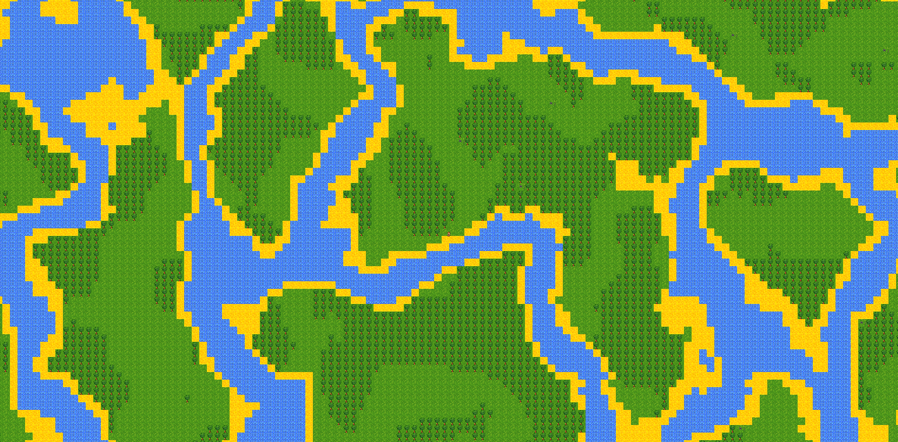
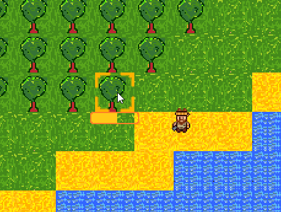
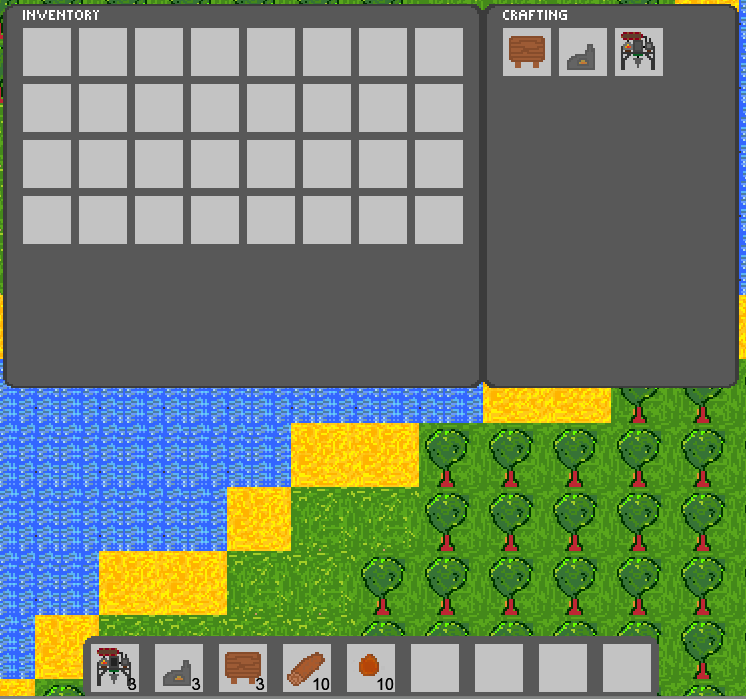
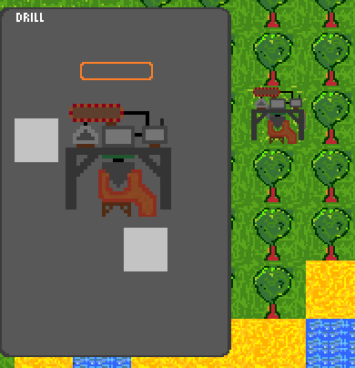
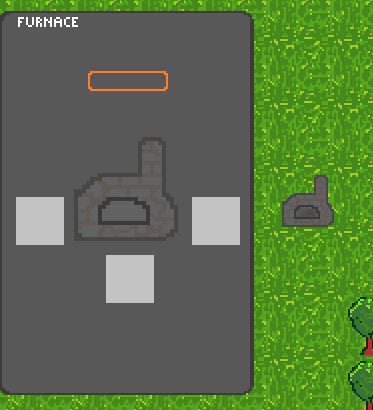

# Industrial Engineer

Jedná se o 2D hru na téma adventure a technických her jako je Terraria a Factorio. Hra je psána v jazyce C# za použití kompletně vlastního herního enginu, který využívá externí grafickou knihovnu SFML.

## Podstatné charakteristiky

### Způsob renderování a načítání světa
Při vykreslování používám dva způsoby. První je na vykreslení samotné mapy čímž je ono dvourozměrné pole. A druhý vykresluje Sprity. 
- U prvního způsobu se načte ***TileId*** každého z bloků a z disku se načte ***Tileset***
z něhož se pak vytvoří ***Tilemapa***, která je potom vykreslována na okno.

- Druhý způsob je vykreslování jednotlivých ***Spritů***. Tento způsob používám při vykreslování například Gui nebo nějakých staveb na mapu. U tohoto
způsobu je to složitější, protože Sprity se vykreslují na konkrétní pozici a tak, když potom pohnu pohledem, zůstanou na místě tato vlastnost se hodí třeba při vykreslování staveb. Je ale krajně nežádoucí při vykreslování 
Gui. Proto je u každé komponenty, která by se měla vykreslovat na jednom místě implementována funkce, která před každým vykreslením znovu vypočítá pozici komponenty vzhledem ke středu pohledu (View). 

- Z těchto výpočtů 
byl nejtěžší výpočet pozice kurzoru, jež znázorňuje konkrétní blok na mapě, na než míří kurzor myši. Muselo se totiž vypočítat nejen pozici, kde se vykreslí, ale zároveň ji bylo potřeba upravit tak, aby oranžový čtverec 
kurzoru přesně ležel na daném bloku. Tato pozice se počítalo vzhledem k načtené části mapy. Pro například položení stavby nebo vytěžení se proto musí převést ještě na pozici v hlavním poli, které představuje mapu, aby 
bylo možno změnit daný blok. A viditelná část se pak načte znovu.

- Další zajímavá informace o vykreslování a načítání mapy je to, že se nevykresluje celá, protože aktuálně je velikost nastavena 1000 na 1000 bloků a bylo by zbytečné ji vykreslovat celou. Z tohoto
důvodu je mapa rozdělena do ***Chunků*** (částí) a následně se vykresluje chunk, na kterém stojí hráč, a pak chunky okolo něj tím je zajištěno, že ať je mapa jakkoli velká, tak vždy bude hra stabilní. 

### Svět 
- Objekt, který provádí operace ohledně třídy ***World*** se nazývá ***WorldManager***. Svět je generován procedurálně za použití knihovny pro generaci perlin noise. Zvuky se generují aktuálně 3 a každý určuje jednu vrstvu
mapy. První vrstva určí, kde bude voda a kde souš, druhá vrstva generuje stromy a třetí vrstva určuje, kde se budou nacházet nerostné suroviny. Svět představuje dvourozměrné pole na plněné objekty Block. Objekt Block 
má vlastnosti jako ***Id, Name, TileId, CanStepOn, Harvestable, CanPlaceOn*** a další. Podstatné je říct, že vlastnosti každého bloku jsou načítány z json souboru, který určuje vlastnosti každého z nich. Každý blok má 
svojí vlastní třídu, čímž je umožněno každému bloku přidat vlastní funkce.

### Konfigurace pomocí jsonu a její systém distribuce 
- Stejně jako načítám vlastnosti bloků, jsou načítány i vlastnosti itemů, crafting receptů a jednotlivých entit/staveb. Pro načtení každého z těchto seznamů se používá vlastní statická ***Factory*** třída, která zpracuje 
cestu dodanou parametrem, načte objekty z jsonu a následně jimi naplní předem připravené objekty ať už bloků nebo itemů. 

- Pro uchování těchto nastavení je ve hře statický objekt ***GameData***, který obsahuje jak právě nastavení jednotlivých věcí ve hře, tak třeba i seznam textur nebo font. 

- Pro všechna načítaná nastavení jsou vytvořeny ***registr*** třídy jako třeba ***ItemRegistry nebo BlockRegistry***, v niž jsou uložena nastavení objektů například bloků jak ***jednotlivě*** tak v ***Listu***.
Tyto objekty pak umí sami zebe kopírovat a tak se například při vytváření světa jde třeba do  
BlockRegistry a zde se nad daným blokem zavolá metoda ***Copy***, která vytvoří objekt stejného typu a vloží do něj přednastavé vlastnosti.

### Gui
- Protože SFML je jenom grafická knihovna a já potřeboval ještě nějaký na vykreslování a obsluhu Gui, nenapadlo mě nic lepšího než si nějaký základní napsat sám. Vytvořil jsem pro to několik tříd, díky nimž gui disponuje
funkce pro ***Drag and Drop*** přesouvání itemů a ***klikání na různá tlačítka***.

- Jednou z nich je třída ***Gui***, která si v sobě udržuje instance všech ***screenů*** (obrazovek), které se ve hře používají. Jsou to například Crafting, Inventory, Hotbar nebo třeba obrazovka
stroje se, kterým právě hráč interaguje. Volá taky jejich metody Draw a aktualizuje jejich pozice vykreslovaní na obrazovce, které jsou v ní definovány buď přesnou pozicí nebo výpočtem od středu
obrazovky a upraveny vzhledem k hodnotám třídy ***Zoom*** a pozicí pohledu (View). Ve třídě ***Gui*** jsou také definoványklikatelné oblasti všech komponent. Pomocí těchto oblastí se pak rozhoduje
zda klik padl na oblast nějaké komponenty či nikoli.

- Manipulace a operace nad třídou ***Gui*** a komponentamy v ní obsaženými provádí třída ***GuiController***. Tato třída řeší právě operace při kliknutí na nějakou komponentu.
Obsluhuje také logiku okolo přesouvání itemů mezi sloty, a to ať už třeba v rámci inventáře nebo mezi komponentami například při vkládání itemů do pece. Je v ní implementována třeba i funkce pro crafting. 

- Dále framework obsahuje několik obrazovek (screenů) jako je ***Crafting, Inventory a Hotbar***, které jsou jeho hlavní. Mimo obrazovek je implementováno mnoho komponent, a to i ty základní.
Základem každé komponenty je třída ***GuiComponent***, kterou všechny komponenty dědí. Z ní pak vychází komponenty jako ***Label, PictureBox, ProgressBarComponent, ItemSlot nebo ItemStorage***.

### Crafting
- Crafting je řešen velice jednoduše a intuitivně. Při otevření inventáře klávesou ***E*** se vpravo objeví obrazovka craftingu a na ní ikonky věcí, které je možno vytvořit. Při kliknutí na daný předmět se z inventáře odeberou příslušné
itemy a přidá se do něj item vytvořený. Recepty pro crafting se opět načítají z jsonu pomocí statické třídy ***RecipeFactory***. Recept obsahuje ***Id, Id výsledného itemu, Count počet itemů a pak pole s potřebnými
ingrediencemi.
- Crafting recepty mohou být ***dvou typů*** a to normální pro ***crafting itemů v inventáři*** anebo pro ***vypékání itemů v peci***.

### Budovy
- Budovy jsou v podstatě takové doplňky bloků. Dají se na ně položit a v bloku jsou uloženy v proměnné ***PlacedBuilding***, z níž se pak načítají do seznamu aktuálně vykreslovaných budov, 
protože nejdříve se renderuje mapa jako taková a na ní pak až budovy. 

- Z proměnné PlacedBuilding se taky načítají budovy pro update, čehož je využito třeba u pecí. Budovy mají podobné vlastnosti jako bloky, a navíc obsahují proměnnou ***Dialog***
, v níž je uložena instance konkrétního dialogu, který se zobrazí po kliknutí na budovu jako je třeba pec nebo vrták.
- Vlastnosti všem budovám opět načítá statická třída ***BuildingsFactory*** a jejich přednastavené objekty ukládá do třídy ***BuildingsRegistry***.

### Těžení
- Těžit je možno buď Budovy nebo nerostné suroviny případně stromy. Zda je na daném bloku možno těžit se zjistí podle nastavení proměnné ***Harvestable***, která je defaultně false pro všechny bloky mimo surovin a stromů. 
- Při vytěžení budovy, se její item vloží do inventáře a v bloku na, 
kterém stála, se nastaví proměnná ***PlacedBuilding*** na ***null*** a díky tomu pak vím, že na bloku nic nestojí.
- Pokud vytěžíme blok tak to, jestli se zničí či nikoli závisí na proměnné ***Richness***. Pokud je Richness 0 tak se blok zničí a nahradí blokem s Id uloženým v proměnné ***FoundationId***. 
Po každém vytěžení se tato proměnná zmenší o 1 a následně se do inventáře přidají itemy podle proměnné ***DropId*** a jejich počet je dán proměnnou ***DropCount*** obsažené ve vytěženém bloku.

### Stavění
- Stavění je opět velice jednoduché. Kliknutím v Hotbaru na item, který se dá postavit, se item zvolí pro stavbu a následně stačí jen kliknout na místo kam chceme, aby se položil. 
- Následně po postavení budovy je její item odebrán z hotbaru a podle jeho proměnné ***PlacedBuildingId*** se z ***BuildingsRegistry*** vybere příslušná stavba a její kopie se nastaví do bloku do proměnné ***PlacedBuilding***.

### Vlákna
- Ve hře je do budoucna připravena implementace pro práci s thready. Ta obsahuje třídu ***ThreadManager***, která se stará o start a stop vláken hry mimo těch hlavních. Udržuje si také seznam se spuštěnými vlákny.
- Zatím je implementován jeden thread a to ***WorldUpdater***, který se stará právě o update všech budov na mapě jako jsou třeba pece.

## Ukázky

### Procedurálně generovaný svět

### Těžení

### Inventář Crafting Hotbar 

### Vrták

### Pec

## Použité technologie

### Rendering
- Pro renderování jsem zvolil C# distribuci v originále C++ knihovny SFML (simple fast media library). Tato knihovna je postavená na grafické knihovně OpenGL. Využívá tedy všech jejich výhod
a poskytuje celkem 5 modulů těmi jsou system, window, graphics, audio and network. Pomocí této knihovny vytvářím okno, vymalovámám na něj textury a obsluhuji eventy co z okna chodí a ty si pak zpracovávám sám.
Odkaz na knihovnu je zde ___https://www.sfml-dev.org/___.

### Procedurální generace světa
- Svět vytvářím za pomoci malé knihovny FastNoiseLite. Pomocí ní generuji perlin noisy, které pak převádím na mapu. Odkaz na knihovnu je zde ___https://github.com/Auburn/FastNoiseLite___.

### Programovací jazyk a verze
- Jako programovací jazyk byl zvolen ***C# .NetFramework v4.8*** kvůli kompatibilitě s knihovnou SFML.

### Autor: Jaroslav Němec T2 SSAKHK 2022/2023

